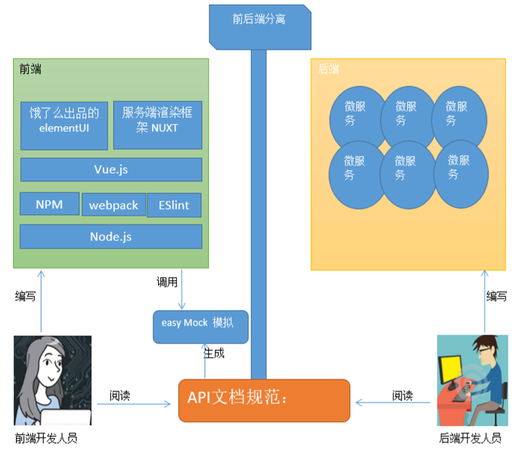
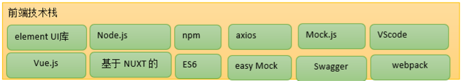
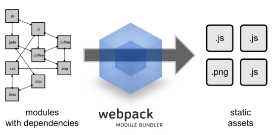

# 第1章 前端环境搭建  

学习目标：

- 了解十次方需求、技术架构，理解前后端分离开发模式
- 掌握Node.js基本使用方法，理解模块化编程
- 掌握包资源管理器NPM的使用
- 说出webpack的作用
- 掌握vs code开发工具的基本使用方法
- 掌握ES6常用的新特性语法


# 1 十次方需求分析与技术架构

## 1.1 十次方是个什么样的网站

《十次方》是程序员的专属社交平台，包括头条、问答、活动、交友、吐槽、招聘六大频道。

 


十次方名称的由来：2的10次方为1024，程序员都懂的。

如果你是一位技术大咖，那么赶快发布文章，增加知名度吧。

如果你是一名技术小白，那么赶快到问答频道寻求帮助的，这里高手如云哦！

如果你不想错过各种技术交流会，那么请经常关注活动频道吧~

如果你还是单身，那么赶快到交友频道找到你心仪的另一半。

如果你有太多的苦恼，那么赶快吐个槽吧~

如果你正在找工作或是想跳槽拿高薪，那么来招聘频道淘金吧~


## 1.2 理解前后端分离开发

​	前后端分离已成为互联网项目开发的业界标准使用方式，通过nginx+tomcat的方式（也可以中间加一个nodejs）有效的进行解耦，并且前后端分离会为以后的大型分布式架构、弹性计算架构、微服务架构、多端化服务（多种客户端，例如：浏览器，车载终端，安卓，IOS等等）打下坚实的基础。

以前老的方式是：

1.产品经理/领导/客户提出需求

2.UI做出设计图

3.前端工程师做html页面

4.后端工程师将html页面套成jsp页面（前后端强依赖，后端必须要等前端的html做好才能套jsp。如果html发生变更，就更痛了，开发效率低）

5.集成出现问题

6.前端返工

7.后端返工

8.二次集成

9.集成成功

10.交付

新的方式是：

1.产品经理/领导/客户提出需求

2.UI做出设计图

3.前后端约定接口&数据&参数

4.前后端并行开发（无强依赖，可前后端并行开发，如果需求变更，只要接口&参数不变，就不用两边都修改代码，开发效率高）

5.前后端集成

6.前端页面调整

7.集成成功

8.交付



## 1.3 前端技术架构



架构描述：以Node.js为核心的Vue.js前端技术生态架构

# 2  Node.js

## 2.1 什么是Node.js

简单的说 Node.js 就是运行在服务端的 JavaScript。

Node.js 是一个基于Chrome JavaScript 运行时建立的一个平台。

Node.js是一个事件驱动I/O服务端JavaScript环境，基于Google的V8引擎，V8引擎执行Javascript的速度非常快，性能非常好。

## 2.2 Node.js安装

1、下载对应你系统的Node.js版本:

[https://nodejs.org/en/download/](https://nodejs.org/en/download/)

（我们现在使用的版本是8.9.4，资源中也已提供）
2、选安装目录进行安装

默认即可

3.测试

在命令提示符下输入命令

```
node -v
```

会显示当前node的版本

## 2.3 快速入门

### 2.3.1 控制台输出

我们现在做个最简单的小例子，演示如何在控制台输出，创建文本文件demo1.js,代码内容

```js
var a=1;
var b=2;
console.log(a+b);
```

我们在命令提示符下输入命令

```shell
node demo1.js
```

### 2.3.2 使用函数

创建文本文件demo2.js

```js
var c=add(100,200);
console.log(c);
function add(a,b){
	return a+b;
}
```

命令提示符输入命令

```sh
node demo2.js
```

运行后看到输出结果为300

### 2.3.3 模块化编程

创建文本文件demo3_1.js

```js
exports.add=function(a,b){
	return a+b;
}
```

创建文本文件demo3_2.js

```js
var demo= require('./demo3_1');
console.log(demo.add(400,600));
```

我们在命令提示符下输入命令

```sh
node demo3_2.js
```

结果为1000

### 2.3.4 创建web服务器

创建文本文件demo4.js

```js
var http = require('http');
http.createServer(function (request, response) {
    // 发送 HTTP 头部 
    // HTTP 状态值: 200 : OK
    // 内容类型: text/plain
    response.writeHead(200, {'Content-Type': 'text/plain'});
    // 发送响应数据 "Hello World"
    response.end('Hello World\n');
}).listen(8888);
// 终端打印如下信息
console.log('Server running at http://127.0.0.1:8888/');
```

http为node内置的web模块

我们在命令提示符下输入命令

```sh
node demo4.js
```

服务启动后，我们打开浏览器，输入网址

[http://localhost:8888/](http://localhost:8888/)

即可看到网页输出结果Hello World

心情是不是很激动呢？Ctrl+c 终止运行。

### 2.3.5 理解服务端渲染

我们创建demo5.js  ，将上边的例子写成循环的形式

```js
var http = require('http');
http.createServer(function (request, response) {
    // 发送 HTTP 头部 
    // HTTP 状态值: 200 : OK
    // 内容类型: text/plain
    response.writeHead(200, {'Content-Type': 'text/plain'});
    // 发送响应数据 "Hello World"
	for(var i=0;i<10;i++){
		response.write('Hello World\n');
	}  
	response.end('');	
}).listen(8888);
// 终端打印如下信息
console.log('Server running at http://127.0.0.1:8888/');
```

我们在命令提示符下输入命令启动服务

```sh
node demo5.js
```

浏览器地址栏输入http://127.0.0.1:8888即可看到查询结果。

我们右键“查看源代码”发现，并没有我们写的for循环语句，而是直接的10条Hello World ，这就说明这个循环是在服务端完成的，而非浏览器（客户端）来完成。这与我们原来的JSP很是相似。

### 2.3.6 接收参数

创建demo6.js

```js
var http = require('http');
var url = require('url');
http.createServer(function(request, response){
    response.writeHead(200, {'Content-Type': 'text/plain'});
    // 解析 url 参数
    var params = url.parse(request.url, true).query;
    response.write("name:" + params.name);
    response.write("\n");
    response.end();
}).listen(8888);
console.log('Server running at http://127.0.0.1:8888/');
```

我们在命令提示符下输入命令

```sh
node demo6.js
```

在浏览器测试结果

# 3 包资源管理器NPM

## 3.1 什么是NPM

npm全称Node Package Manager，他是node包管理和分发工具。其实我们可以把NPM理解为前端的Maven .

我们通过npm 可以很方便地下载js库，管理前端工程.

最近版本的node.js已经集成了npm工具，在命令提示符输入 npm -v 可查看当前npm版本

## 3.2 NPM命令

### 3.2.1 初始化工程

init命令是工程初始化命令。

建立一个空文件夹，在命令提示符进入该文件夹  执行命令初始化

```sh
npm init
```

按照提示输入相关信息，如果是用默认值则直接回车即可。

name: 项目名称

version: 项目版本号

description: 项目描述

keywords: {Array}关键词，便于用户搜索到我们的项目

最后会生成package.json文件，这个是包的配置文件，相当于maven的pom.xml

我们之后也可以根据需要进行修改。

### 3.2.2 本地安装

install命令用于安装某个模块，如果我们想安装express模块（node的web框架），输出命令如下：

```
npm install express
```

出现黄色的是警告信息，可以忽略，请放心，你已经成功执行了该命令。

在该目录下已经出现了一个node_modules文件夹 和package-lock.json

node_modules文件夹用于存放下载的js库（相当于maven的本地仓库）

package-lock.json是当 node_modules 或 package.json 发生变化时自动生成的文件。这个文件主要功能是确定当前安装的包的依赖，以便后续重新安装的时候生成相同的依赖，而忽略项目开发过程中有些依赖已经发生的更新。

我们再打开package.json文件，发现刚才下载的express已经添加到依赖列表中了.

关于版本号定义：

```
指定版本：比如1.2.2，遵循“大版本.次要版本.小版本”的格式规定，安装时只安装指定版本。

波浪号（tilde）+指定版本：比如~1.2.2，表示安装1.2.x的最新版本（不低于1.2.2），但是不安装1.3.x，也就是说安装时不改变大版本号和次要版本号。

插入号（caret）+指定版本：比如ˆ1.2.2，表示安装1.x.x的最新版本（不低于1.2.2），但是不安装2.x.x，也就是说安装时不改变大版本号。需要注意的是，如果大版本号为0，则插入号的行为与波浪号相同，这是因为此时处于开发阶段，即使是次要版本号变动，也可能带来程序的不兼容。

latest：安装最新版本。
```

### 3.2.3 全局安装

刚才我们使用的是本地安装，会将js库安装在当前目录，而使用全局安装会将库安装到你的全局目录下。

如果你不知道你的全局目录在哪里，执行命令

```
npm root -g
```

我的全局目录在

C:\Users\Administrator\AppData\Roaming\npm\node_modules

比如我们全局安装jquery,  输入以下命令

```sh
npm install jquery -g
```

> 如果无法运行安装的命令，将全局目录的上一级添加到环境变量：C:\Users\Administrator\AppData\Roaming\npm


### 3.2.4 批量下载

我们从网上下载某些代码，发现只有package.json,没有node_modules文件夹，这时我们需要通过命令重新下载这些js库.

进入目录（package.json所在的目录）输入命令

```sh
npm install
```

此时，npm会自动下载package.json中依赖的js库.

### 3.2.5淘宝NPM镜像

有时我们使用npm下载资源会很慢，所以我们可以安装一个cnmp(淘宝镜像)来加快下载速度。

输入命令，进行全局安装淘宝镜像。

```
npm install -g cnpm --registry=https://registry.npm.taobao.org
```

安装后，我们可以使用以下命令来查看cnpm的版本

```
cnpm -v
```

使用cnpm

```
cnpm install 需要下载的js库
```


### 3.2.6 运行工程

如果我们想运行某个工程，则使用run命令

如果package.json中定义的脚本如下


dev是开发阶段测试运行

build是构建编译工程

lint 是运行js代码检测 

我们现在来试一下运行dev

```sh
npm run dev
```

### 3.2.7 编译工程

我们接下来，测试一个代码的编译.编译后我们就可以将工程部署到nginx中啦~

编译后的代码会放在dist文件夹中，首先我们先删除dist文件夹中的文件,进入命令提示符输入命令

```sh
npm run build
```

生成后我们会发现只有个静态页面，和一个static文件夹

这种工程我们称之为单页Web应用（single page web application，SPA），就是只有一张Web页面的应用，是加载单个HTML 页面并在用户与应用程序交互时动态更新该页面的Web应用程序。

这里其实是调用了webpack来实现打包的，关于webpack我们后续的章节进行介绍

# 4 Webpack

## 4.1 什么是Webpack

​	Webpack 是一个前端资源加载/打包工具。它将根据模块的依赖关系进行静态分析，然后将这些模块按照指定的规则生成对应的静态资源。

 

​	从图中我们可以看出，Webpack 可以将多种静态资源 js、css、less 转换成一个静态文件，减少了页面的请求。  接下来我们简单为大家介绍 Webpack 的安装与使用

## 4.2 Webpack安装

全局安装

```
npm install webpack -g
npm install webpack-cli -g
```

安装后查看版本号

```
webpack -v
```

## 4.3 快速入门

### 4.3.1  JS打包

（1）创建src文件夹，创建bar.js

```js
exports.info=function(str){
   document.write(str);
}
```

（2）src下创建logic.js

```js
exports.add=function(a,b){
	return a+b;
}
```

（3）src下创建main.js

```js
var bar= require('./bar');
var logic= require('./logic');
bar.info( 'Hello world!'+ logic.add(100,200));
```

（4）创建配置文件webpack.config.js  ，该文件与src处于同级目录

```js
var path = require("path");
module.exports = {
	entry: './src/main.js',
	output: {
		path: path.resolve(__dirname, './dist'),
		filename: 'bundle.js'
	}
};
```

以上代码的意思是：读取当前目录下src文件夹中的main.js（入口文件）内容，把对应的js文件打包，打包后的文件放入当前目录（__dirname为全局变量表示当前目录）的dist文件夹下，打包后的js文件名为bundle.js

（5）执行编译命令

```
webpack
```

执行后查看bundle.js 会发现里面包含了上面两个js文件的内容

（7）创建index.html ,引用bundle.js

```html
<!doctype html>
<html>
  <head>  
  </head>
  <body>   
    <script src="dist/bundle.js"></script>
  </body>
</html>
```

测试调用index.html，会发现有内容输出

### 4.3.2 CSS打包

（1）安装style-loader和 css-loader

Webpack 本身只能处理 JavaScript 模块，如果要处理其他类型的文件，就需要使用 loader 进行转换。

Loader 可以理解为是模块和资源的转换器，它本身是一个函数，接受源文件作为参数，返回转换的结果。这样，我们就可以通过 require 来加载任何类型的模块或文件，比如 CoffeeScript、 JSX、 LESS 或图片。首先我们需要安装相关Loader插件，css-loader 是将 css 装载到 javascript；style-loader 是让 javascript 认识css

```
cnpm install style-loader css-loader --save-dev
```

（2）修改webpack.config.js

```js
var path = require("path");
module.exports = {
	entry: './src/main.js',
	output: {
		path: path.resolve(__dirname, './dist'),
		filename: 'bundle.js'
	},
	module: {
		rules: [  
            {  
                test: /\.css$/,  
                use: ['style-loader', 'css-loader']
            }  
        ]  
	}
};
```

（3）在src文件夹创建css文件夹,css文件夹下创建css1

```css
body{
 background:red;
}
```

（4）修改main.js ，引入css1.css

```
require('./css1.css');
```

（5）重新运行webpack

（6）运行index.html看看背景是不是变成红色啦？


# 5 开发工具VsCode

## 5.1 VsCode简介

​	VSCode（ Visual Studio Code）是微软出的一款轻量级代码编辑器 ，重要的是它在Windows, OS X 和Linux操作系统的桌面上均可运行。Visual Studio Code内置了对JavaScript, TypeScript和Node.js语言的支持，并且为其他语言如C++, C#, Python, PHP等提供了丰富的扩展库和运行时。

​		

## 5.2 VsCode安装与配置

### 5.2.1安装

官网下载  https://code.visualstudio.com/

默认安装即可

### 5.2.2插件安装

VsCode可以通过安装插件来使编辑器变的更加强大

以下为前端开发工程师常用插件

（1）HTML Snippets

超级实用且初级的 H5代码片段以及提示

（2）HTML CSS Support

让 html 标签上写class 智能提示当前项目所支持的样式  新版已经支持scss文件检索

（3）Debugger for Chrome

让 vscode 映射 chrome 的 debug功能，静态页面都可以用 vscode 来打断点调试，真666~ 

（4）vetur

vue框架所需的插件  语法高亮、智能感知、Emmet等

（5）VueHelper

snippet代码片段

### 5.2.3配置自动保存

点击菜单 ：文件--勾选自动保存


# 6 ES6

## 6.1 什么是ES6

编程语言JavaScript是ECMAScript的实现和扩展 。ECMAScript是由ECMA（一个类似W3C的标准组织）参与进行标准化的语法规范。ECMAScript定义了：

[语言语法](https://developer.mozilla.org/en-US/docs/Web/JavaScript/Reference/Lexical_grammar) – 语法解析规则、关键字、语句、声明、运算符等。

[类型](https://developer.mozilla.org/en-US/docs/Web/JavaScript/Data_structures) – 布尔型、数字、字符串、对象等。

[原型和继承](https://developer.mozilla.org/en-US/docs/Web/JavaScript/Inheritance_and_the_prototype_chain)

内建对象和函数的[标准库](https://developer.mozilla.org/en-US/docs/Web/JavaScript/Reference/Global_Objects) – [JSON](https://developer.mozilla.org/en-US/docs/Web/JavaScript/Reference/Global_Objects/JSON)、[Math](https://developer.mozilla.org/en-US/docs/Web/JavaScript/Reference/Global_Objects/Math)、[数组方法](https://developer.mozilla.org/en-US/docs/Web/JavaScript/Reference/Global_Objects/Array)、[对象自省方法](https://developer.mozilla.org/en-US/docs/Web/JavaScript/Reference/Global_Objects/Object)等。

ECMAScript标准不定义HTML或CSS的相关功能，也不定义类似DOM（文档对象模型）的[Web API](https://developer.mozilla.org/en-US/docs/Web/API)，这些都在独立的标准中进行定义。ECMAScript涵盖了各种环境中JS的使用场景，无论是浏览器环境还是类似[node.js](http://nodejs.org/)的非浏览器环境。

ECMAScript标准的历史版本分别是1、2、3、5。

那么为什么没有第4版？其实，在过去确实曾计划发布提出巨量新特性的第4版，但最终却因想法太过激进而惨遭废除（这一版标准中曾经有一个极其复杂的支持泛型和类型推断的内建静态类型系统）。

ES4饱受争议，当标准委员会最终停止开发ES4时，其成员同意发布一个相对谦和的ES5版本，随后继续制定一些更具实质性的新特性。这一明确的协商协议最终命名为“Harmony”，因此，ES5规范中包含这样两句话

> ECMAScript是一门充满活力的语言，并在不断进化中。
>
> 未来版本的规范中将持续进行重要的技术改进

2009年发布的改进版本ES5，引入了[Object.create()](https://developer.mozilla.org/en-US/docs/Web/JavaScript/Reference/Global_Objects/Object/create)、[Object.defineProperty()](https://developer.mozilla.org/en-US/docs/Web/JavaScript/Reference/Global_Objects/Object/defineProperty)、[getters](https://developer.mozilla.org/en-US/docs/Web/JavaScript/Reference/Functions/get)和[setters](https://developer.mozilla.org/en-US/docs/Web/JavaScript/Reference/Functions/set)、[严格模式](https://developer.mozilla.org/en-US/docs/Web/JavaScript/Reference/Strict_mode)以及[JSON](https://developer.mozilla.org/en-US/docs/Web/JavaScript/Reference/Global_Objects/JSON)对象。

ECMAScript 6.0（以下简称ES6）是JavaScript语言的下一代标准，2015年6月正式发布。它的目标，是使得JavaScript语言可以用来编写复杂的大型应用程序，成为企业级开发语言。

## 6.2 Node.js中使用ES6

ES6+ 太棒了,但是很多高级功能node是不支持的,就需要使用babel转换成ES5

 （1）babel转换配置,项目根目录添加.babelrc 文件

```json
{
  "presets" : ['es2015']
}
```

（2）安装es6转换模块

```
cnpm install babel-preset-es2015 --save-dev
```

（3）全局安装命令行工具

```
cnpm install  babel-cli -g
```

（4）使用

```
babel-node js文件名
```


## 6.3 语法新特性

### 6.3.1 变量声明let

我们都是知道在ES6以前，var关键字声明变量。无论声明在何处，都会被视为声明在函数的最顶部(不在函数内即在全局作用域的最顶部)。这就是函数变量提升例如

```js
function aa() {
    if(bool) {
        var test = 'hello man'
    } else {
        console.log(test)
    }
}
```

以上的代码实际上是:

```js
function aa() {
    var test // 变量提升
    if(bool) {
        test = 'hello man'
    } else {
        //此处访问test 值为undefined
        console.log(test)
    }
    //此处访问test 值为undefined
  }
```

所以不用关心bool是否为true or false。实际上，无论如何test都会被创建声明。

接下来ES6主角登场：

我们通常用let和const来声明，let表示变量、const表示常量。let和const都是块级作用域。怎么理解这个块级作用域？在一个函数内部 ，在一个代码块内部。看以下代码

```js
 function aa() {
    if(bool) {
       let test = 'hello man'
    } else {
        //test 在此处访问不到
        console.log(test)
    }
  }
```

### 6.3.2 常量声明

const 用于声明常量，看以下代码

```js
const name = 'lux'
name = 'joe' //再次赋值此时会报错
```


### 6.3.3 模板字符串

es6模板字符简直是开发者的福音啊，解决了ES5在字符串功能上的痛点。

第一个用途，基本的字符串格式化。将表达式嵌入字符串中进行拼接。用${}来界定。

```js
//es5 
var name = 'lux'
console.log('hello' + name)
//es6
const name = 'lux'
console.log(`hello ${name}`) //hello lux
```

第二个用途，在ES5时我们通过反斜杠(\)来做多行字符串或者字符串一行行拼接。ES6反引号(``)直接搞定。

```js
// es5
var msg = "Hi \
man!"
// es6
const template = `<div>
<span>hello world</span>
</div>`
```

### 6.3.4 函数默认参数

ES6为参数提供了默认值。在定义函数时便初始化了这个参数，以便在参数没有被传递进去时使用。

看例子代码

```js
function action(num = 200) {
    console.log(num)
}
action() //200
action(300) //300
```

### 6.3.5 箭头函数

ES6很有意思的一部分就是函数的快捷写法。也就是箭头函数。

箭头函数最直观的三个特点。

1不需要function关键字来创建函数

2省略return关键字

3继承当前上下文的 this 关键字

看下面代码（ES6）

```js
 (response,message) => {
    .......
 }
```

相当于ES5代码

```js
function(response,message){
    ......
}
```

### 6.3.6 对象初始化简写

ES5我们对于对象都是以键值对的形式书写，是有可能出现键值对重名的。例如

```js
function people(name, age) {
    return {
        name: name,
        age: age
    };
}
```

以上代码可以简写为

```js
function people(name, age) {
    return {
        name,
        age
    };
}
```

### 6.3.7 解构

数组和对象是JS中最常用也是最重要表示形式。为了简化提取信息，ES6新增了解构，这是将一个数据结构分解为更小的部分的过程

ES5我们提取对象中的信息形式如下

```js
const people = {
    name: 'lux',
    age: 20
}
const name = people.name
const age = people.age
console.log(name + ' --- ' + age)
```

是不是觉得很熟悉，没错，在ES6之前我们就是这样获取对象信息的，一个一个获取。现在，ES6的解构能让我们从对象或者数组里取出数据存为变量，例如

```js
//对象
const people = {
    name: 'lux',
    age: 20
}
const { name, age } = people
console.log(`${name} --- ${age}`)
//数组
const color = ['red', 'blue']
const [first, second] = color
console.log(first) //'red'
console.log(second) //'blue'
```

### 6.3.8 Spread Operator

ES6中另外一个好玩的特性就是Spread Operator 也是三个点儿...接下来就展示一下它的用途。 组装对象或者数组

```js
//数组
const color = ['red', 'yellow']
const colorful = [...color, 'green', 'pink']
console.log(colorful) //[red, yellow, green, pink]

//对象
const alp = { fist: 'a', second: 'b'}
const alphabets = { ...alp, third: 'c' }
console.log(alphabets) //{ "fist": "a", "second": "b", "third": "c"
```

### 6.3.9 import 和 export

import导入模块、export导出模块

lib.js

```js
let fn0=function(){
    console.log('fn0...');
}
export {fn0}
```

demo9.js

```js
import {fn0} from './lib'
fn0();
```

注意：node(v8.x)本身并不支持import关键字，所以我们需要使用babel的命令行工具来执行（配置详见6.2小节内容）

```
babel-node demo9
```

### 6.3.10 Promise（自学内容）

​	Promise 是异步编程的一种解决方案，比传统的解决方案–回调函数和事件－－更合理和更强大。它由社区最早提出和实现，ES6将其写进了语言标准，统一了语法，原生提供了Promise.

​	此知识点属于本章自学内容，请同学们百度promise查阅文章完成自学（完成测试代码，整理自学笔记）。
