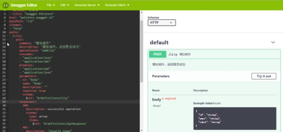
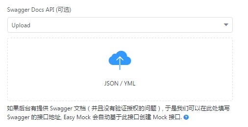

# 十次方前端系统开发-第2章  

# SwaggerAPI

学习目标：


# 1.Swagger简介

## 1.1什么是Swagger

​	随着互联网技术的发展，现在的网站架构基本都由原来的后端渲染，变成了：前端渲染、先后端分离的形态，而且前端技术和后端技术在各自的道路上越走越远。 
​	前端和后端的唯一联系，变成了API接口；API文档变成了前后端开发人员联系的纽带，变得越来越重要，`swagger`就是一款让你更好的书写API文档的框架。
## 1.2 Swagger Editor安装与启动

（1）到官网下载 https://swagger.io/download-page/  。

（2）解压swagger-editor-master,

（3）安装

```
npm install 
```

（4）启动swagger-editor

```
npm start
```

（5）浏览器打开： http://localhost:3001/#  

## 1.3 Swagger语法规则

### 1.3.1字段类型与格式定义

| 普通的名字    | type    | format    | 说明                              |
| -------- | ------- | --------- | ------------------------------- |
| integer  | integer | int32     | 签署了32位                          |
| long     | integer | int64     | 签署了64位                          |
| float    | number  | float     |                                 |
| double   | number  | double    |                                 |
| string   | string  |           |                                 |
| byte     | string  | byte      | base64编码的字符                     |
| binary   | string  | binary    | 任何的八位字节序列                       |
| boolean  | boolean |           |                                 |
| date     | string  | date      | 所定义的full-date- - - - - -RFC3339 |
| dateTime | string  | date-time | 所定义的date-time- - - - - -RFC3339 |
| password | string  | password  | 用来提示用户界面输入需要模糊。                 |

### 1.3.2固定字段

| 字段名                 | 类型                                     | 描述                                       |
| ------------------- | -------------------------------------- | ---------------------------------------- |
| swagger             | string                                 | 必需的。使用指定的规范版本。 可以用它大摇大摆的UI和其他客户解释API清单。 的值必须"2.0"。 |
| info                | Info Object                            | 必需的。提供元数据API。 可以使用元数据的客户如果需要。            |
| host                | string                                 | [主机名或ip服务API。 这一定是主机,不包括计划和sub-paths。 这可能包括一个港口。 如果host不包括,使用主机服务文档(包括港口)。 的host不支持路径模板。](#pathTemplating) |
| basePath            | string                                 | API的基本路径,这是相对的host。 如果不包括,API是直属host。 必须从价值领先斜杠(/)。 的basePath不支持路径模板。 |
| schemes             | [string]                               | API的传输协议。 值必须从列表中:"http","https","ws","wss"。 如果schemes不包括,默认使用计划是用于访问大摇大摆的定义本身。 |
| consumes            | [string]                               | [一个MIME类型的api可以使用列表。 这是可以覆盖全球所有API,但在特定的API调用。 值必须是所描述的Mime类型。](#mimeTypes) |
| produces            | [string]                               | [MIME类型的api可以产生的列表。 这是可以覆盖全球所有API,但在特定的API调用。 值必须是所描述的Mime类型。](#mimeTypes) |
| paths               | [路径对象](#pathsObject)                   | 必需的。可用的路径和操作的API。                        |
| definitions         | [定义对象](#definitionsObject)             | 一个对象数据类型生产和使用操作。                         |
| parameters          | [参数定义对象](#parametersDefinitionsObject) | 一个对象来保存参数,可以使用在操作。 这个属性不为所有操作定义全局参数。     |
| responses           | [反应定义对象](#responsesDefinitionsObject)  | 一个对象响应,可以跨操作使用。 这个属性不为所有操作定义全球响应。        |
| securityDefinitions | [安全定义对象](#securityDefinitionsObject)   | 安全方案定义规范,可以使用。                           |
| security            | [(安全需求对\]](#securityRequirementObject) | 声明的安全计划申请API作为一个整体。 值的列表描述替代安全方案,可以使用(也就是说,有一个逻辑或安全需求之间)。 个人业务可以覆盖这个定义。 |
| tags                | [(标签对\]](#tagObject)                   | [的列表标签使用的规范与额外的元数据。 标签的顺序可以用来反思他们的订单的解析工具。 并不是所有使用的标签操作对象必须声明。 声明的标签不可能组织随机或基于工具的逻辑。 列表中的每个标记名称必须是唯一的。](#operationObject) |
| externalDocs        | [外部文档对象](#externalDocumentationObject) | 额外的外部文档。                                 |
| tags                | (string]                               | 的标签列表API文档控制。 标签可用于逻辑分组业务的资源或任何其他限定符。    |
| summary             | string                                 | 什么操作的一个简短的总结。 最大swagger-ui可读性,这一领域应小于120个字符。 |
| description         | string                                 | [详细解释操作的行为。GFM语法可用于富文本表示。](https://help.github.com/articles/github-flavored-markdown) |
| externalDocs        | [外部文档对象](#externalDocumentationObject) | 额外的外部文档操作。                               |
| operationId         | string                                 | 独特的字符串用于识别操作。 id必须是唯一的在所有业务中所描述的API。 工具和库可以使用operationId来唯一地标识一个操作,因此,建议遵循通用的编程的命名约定。 |
| consumes            | [string]                               | MIME类型的列表操作可以使用。 这将覆盖consumes定义在炫耀的对象。 空值可用于全球定义清楚。 值必须是所描述的Mime类型。 |
| produces            | [string]                               | MIME类型的列表操作可以产生。 这将覆盖produces定义在炫耀的对象。 空值可用于全球定义清楚。 值必须是所描述的Mime类型。 |
| parameters          | (参数对象 \|引用对象]                          | 适用于该操作的参数列表。 如果已经定义了一个参数道路项目新定义将覆盖它,但不能删除它。 必须不包含重复的参数列表。 一个独特的参数定义的组合的名字和位置。 可以使用列表引用对象链接到参数的定义的对象的参数。 可以有一个“身体”参数。 |
| responses           | [响应对象](#responsesObject)               | 必需的。返回的列表可能的反应,因为他们执行这个操作。               |
| schemes             | [string]                               | [传输协议的操作。 值必须从列表中:"http","https","ws","wss"。 的值将覆盖的对象schemes定义。](#swaggerSchemes) |
| deprecated          | boolean                                | 声明该操作被弃用。 使用声明的操作应该没有。 默认值是false。        |
| security            | [(安全需求对\]](#securityRequirementObject) | [声明的安全计划申请这个操作。 值的列表描述替代安全方案,可以使用(也就是说,有一个逻辑或安全需求之间)。 这个定义覆盖任何宣布顶级security。 删除一个顶级安全声明,可以使用一个空数组。](#swaggerSecurity) |


# 2.基础模块API

## 2.1城市API

### 2.1.1新增城市

```yaml
swagger: "2.0"
info:
  description: "城市"
  version: "1.0.0"
  title: "Swagger Petstore"
host: "petstore.swagger.io"
basePath: "/api"
schemes:
- "http"
paths:
  '/city':
    post:
      summary: "增加城市"
      description: "增加城市，返回是否成功"
      operationId: "addCity"
      consumes:
      - "application/json"
      produces:
      - "application/json"
      parameters:
      - in: "body"
        name: "body"
        description: ""
        required: true
        schema:
          $ref: "#/definitions/City"
      responses:
        200:
          description: successful operation
          schema:
            $ref: '#/definitions/ApiResponse'
        405:
          description: "Invalid input"
definitions:
  City:
    type: "object"
    properties:
      id:
        type: "string"
        description: "ID"
      name:
        type: "string"
        description: "城市名称"
      ishot:
        type: "string"
        description: "是否热门"
    xml:
      name: "City"
  ApiResponse:
    type: "object"
    properties:
      code:
        type: "integer"
        format: "int32"
      flag:
        type: "boolean"
      message:
        type: "string"
```

编辑后可以在右侧窗口看到显示的效果： 

### 2.1.2返回城市列表

（1）在definitions下定义城市列表对象以及相应对象

```yaml
  CityList:
    type: "array"
    items: 
      $ref: '#/definitions/City'
  ApiCityListResponse:
    type: "object"
    properties:
      code:
        type: "integer"
        format: "int32"
      flag:
        type: "boolean"
      message:
        type: "string"
      data:
        $ref: '#/definitions/CityList'
```

（2）在/city增加get

```yaml
    get:
      summary: "城市全部列表"
      description: "返回城市全部列表"
      operationId: "findCityList"
      produces:
      - "application/json"
      responses:
        200:
          description: "成功查询到数据"
          schema: 
            $ref: '#/definitions/ApiCityListResponse'
        405:
          description: "Invalid input"
```

### 2.1.3根据ID查询城市

（1）在definitions下定义城市对象的响应对象

```yaml
  ApiCityResponse:
    type: "object"
    properties:
      code:
        type: "integer"
        format: "int32"
      flag:
        type: "boolean"
      message:
        type: "string"
      data:
        $ref: '#/definitions/City'
```

（2）新增/city/{cityId} ，设置get方法API

```yaml
  '/city/{cityId}':
    get:
      summary: 根据ID查询
      description: 返回一个城市
      operationId: getCityById
      produces:
        - application/json
      parameters:
        - name: cityId
          in: path
          description: 城市ID
          required: true
          type: integer
          format: int64
      responses:
        '200':
          description: 操作成功
          schema:
            $ref: '#/definitions/City'
        '404':
          description: 没找到城市
```

### 2.1.4修改城市

/city/{cityId} 下增加put

```yaml
    put:
      summary: "修改城市"
      description: "修改城市，返回是否成功"
      operationId: "updateCity"
      consumes:
      - "application/json"
      produces:
      - "application/json"
      parameters:
        - name: cityId
          in: path
          description: 城市ID
          required: true
          type: integer
          format: int64
        - name: "body"
          in: "body"
          description: ""
          required: true
          schema:
            $ref: "#/definitions/City"
      responses:
        200:
          description: "修改成功"
          schema:
            $ref: '#/definitions/ApiResponse'
        405:
          description: "输入无效"
```

### 2.1.5删除城市

/city/{cityId} 下增加delete

```yaml
    delete:
      summary: 根据ID删除
      description: 返回是否成功
      operationId: deleteCityById
      produces:
        - application/json
      parameters:
        - name: cityId
          in: path
          description: 城市ID
          required: true
          type: integer
          format: int64
      responses:
        '200':
          description: 操作成功
          schema:
            $ref: '#/definitions/ApiResponse'
        '404':
          description: 没找到城市
```

### 2.1.6城市分页列表

（1）在definitions下定义城市分页列表响应对象

```yaml
  ApiCityPageResponse:
    type: "object"
    properties:
      code:
        type: "integer"
        format: "int32"
      flag:
        type: "boolean"
      message:
        type: "string"
      data:
        properties:
          total:
            type: "integer"
            format: "int32"
          rows:
            $ref: '#/definitions/CityList'
```

（2）新增节点

```yaml
  '/city/search/{page}/{size}':
    post:
      summary: "城市分页"
      description: "显示城市分页数据"
      operationId: "cityPage"
      consumes:
      - "application/json"
      produces:
      - "application/json"
      parameters:
        - name: page
          in: path
          description: 页码
          required: true
          type: integer
          format: int64
        - name: size
          in: path
          description: "页码"
          required: true
          type: integer
          format: int64
        - name: "body"
          in: "body"
          description: "查询条件"
          required: true
          schema:
            $ref: "#/definitions/City"
      responses:
        200:
          description: 查询成功
          schema:
            $ref: '#/definitions/ApiCityPageResponse'
        405:
          description: "Invalid input"
```

最终完整的Swagger文档如下：

```yaml
swagger: "2.0"
info:
  description: "城市"
  version: "1.0.0"
  title: "十次方API列表-城市"
host: "petstore.swagger.io"
basePath: "/api"
schemes:
- "http"
paths:
  '/city':
    post:
      summary: "增加城市"
      description: "增加城市，返回是否成功"
      operationId: "addCity"
      consumes:
      - "application/json"
      produces:
      - "application/json"
      parameters:
      - in: "body"
        name: "body"
        description: ""
        required: true
        schema:
          $ref: "#/definitions/City"
      responses:
        200:
          description: successful operation
          schema:
            $ref: '#/definitions/ApiResponse'
        405:
          description: "Invalid input"
    get:
      summary: "城市全部列表"
      description: "返回城市全部列表"
      operationId: "findCityList"
      produces:
      - "application/json"
      responses:
        200:
          description: "成功查询到数据"
          schema: 
            $ref: '#/definitions/ApiCityListResponse'
        405:
          description: "Invalid input"
  '/city/{cityId}':
    get:
      summary: 根据ID查询
      description: 返回一个城市
      operationId: getCityById
      produces:
        - application/json
      parameters:
        - name: cityId
          in: path
          description: 城市ID
          required: true
          type: integer
          format: int64
      responses:
        '200':
          description: 操作成功
          schema:
            $ref: '#/definitions/ApiCityResponse'
        '404':
          description: 没找到城市
    put:
      summary: "修改城市"
      description: "修改城市，返回是否成功"
      operationId: "updateCity"
      consumes:
      - "application/json"
      produces:
      - "application/json"
      parameters:
        - name: cityId
          in: path
          description: 城市ID
          required: true
          type: integer
          format: int64
        - name: "body"
          in: "body"
          description: ""
          required: true
          schema:
            $ref: "#/definitions/City"
      responses:
        200:
          description: "修改成功"
          schema:
            $ref: '#/definitions/ApiResponse'
        405:
          description: "输入无效"
    delete:
      summary: 根据ID删除
      description: 返回是否成功
      operationId: deleteCityById
      produces:
        - application/json
      parameters:
        - name: cityId
          in: path
          description: 城市ID
          required: true
          type: integer
          format: int64
      responses:
        '200':
          description: 操作成功
          schema:
            $ref: '#/definitions/ApiResponse'
        '404':
          description: 没找到城市
  '/city/search/{page}/{size}':
    post:
      summary: "城市分页"
      description: "显示城市分页数据"
      operationId: "cityPage"
      consumes:
      - "application/json"
      produces:
      - "application/json"
      parameters:
        - name: page
          in: path
          description: 页码
          required: true
          type: integer
          format: int64
        - name: size
          in: path
          description: "页码"
          required: true
          type: integer
          format: int64
        - name: "body"
          in: "body"
          description: "查询条件"
          required: true
          schema:
            $ref: "#/definitions/City"
      responses:
        200:
          description: 查询成功
          schema:
            $ref: '#/definitions/ApiCityPageResponse'
        405:
          description: "Invalid input"
definitions:
  City:
    type: "object"
    properties:
      id:
        type: "string"
        description: "ID"
      name:
        type: "string"
        description: "城市名称"
      ishot:
        type: "string"
        description: "是否热门"
    xml:
      name: "City"
  CityList:
    type: "array"
    items: 
      $ref: '#/definitions/City'
  ApiResponse:
    type: "object"
    properties:
      code:
        type: "integer"
        format: "int32"
      flag:
        type: "boolean"
      message:
        type: "string"
  ApiCityResponse:
    type: "object"
    properties:
      code:
        type: "integer"
        format: "int32"
      flag:
        type: "boolean"
      message:
        type: "string"
      data:
        $ref: '#/definitions/City'
  ApiCityListResponse:
    type: "object"
    properties:
      code:
        type: "integer"
        format: "int32"
      flag:
        type: "boolean"
      message:
        type: "string"
      data:
        $ref: '#/definitions/CityList'
  ApiCityPageResponse:
    type: "object"
    properties:
      code:
        type: "integer"
        format: "int64"
      flag:
        type: "boolean"
      message:
        type: "string"
      data:
        properties:
          total:
            type: "integer"
            format: "int32"
          rows:
            $ref: '#/definitions/CityList'
```


## 2.2同步到EasyMock 

我们可以将写好的Swagger文档同步到easyMock上

步骤：

（1）导出文档  。点击菜单File -- as a YAML .  将导出的文档拷贝出来放到容易找到的地方，将扩展名改为yml 

（2）打开easyMock,进入项目。点击设置，Swagger Docs API (可选)选择Upload 。 将导出的yml文件拖动到下面的空白区域。



然后点击保存。

（3）选择接口列表，点击“同步Swagger” 

## 2.3代码生成器批量生成

我们通过代码生成器自动生成所有表的yml文档

自动生成的文档中类型均为string ，我们这里需要再对类型进行修改即可。

## 2.4标签API

学员实现，代码略

# 3.用户模块API

## 3.1用户API

### 3.1.1修改User实体定义

```yaml
    User:
    type: "object"
    properties:
      id:
        type: "string"        
        description: "ID"
      loginname:
        type: "string"        
        description: "登陆名"
      password:
        type: "string"        
        description: "密码"
      nickname:
        type: "string"        
        description: "昵称"
      sex:
        type: "string"        
        description: "性别"
      birthday:
        type: "string"        
        format: 'date-time'
        description: "出生年月日"
      image:
        type: "string"        
        description: "头像"
      mobile:
        type: "string"        
        description: "手机号码"
      email:
        type: "string"        
        description: "E-Mail"
      regdate:
        type: "string"        
        format: 'date'
        description: "注册日期"
      updatedate:
        type: "string"        
        description: "修改日期"
        format: 'date'
      lastdate:
        type: "string"        
        description: "最后登陆日期"
        format: 'date'
      online:
        type: "integer"     
        format: 'int64'
        description: "在线时长（分钟）"
      interest:
        type: "string"        
        description: "兴趣"
      personality:
        type: "string"        
        description: "个性"
      fanscount:
        type: "integer"        
        description: "粉丝数"
        format: 'int64'
      followcount:
        type: "integer"        
        description: "关注数"
        format: 'int64'
```

### 3.1.2发送手机验证码

修改user.yml ,增加

```yaml
  /sendsms/{mobile}:
    get:
      summary: "发送手机验证码"
      description: "发送手机验证码"
      operationId: "sendsms"
      consumes:
      - "application/json"
      produces:
      - "application/json"
      parameters:
        - name: mobile
          in: path
          description: 手机号
          required: true
          type: integer
          format: int64
      responses:
        200:
          description: 发送成功
          schema:
            $ref: '#/definitions/ApiResponse'
        405:
          description: "Invalid input"
```

### 3.1.3用户上传头像

```yaml
  /user/upload:
    post:
      summary: 上传头像
      description: 上传头像
      consumes: 
      - "multipart/form-data"
      parameters: 
        - name: file
          in: formData
          required: true
          type: file
      responses:
        200:
          description: OK
          schema:
            $ref: '#/definitions/ApiResponse'
```

### 3.1.4关注某用户

```yaml
  /user/follow/{userId}:
    put:
      summary: "关注某用户"
      description: "关注某用户"
      consumes:
      - "application/json"
      produces:
      - "application/json"
      parameters: 
        - name: userId
          in: path
          required: true
          type: string
      responses:
        200:
          description: OK
          schema:
            $ref: '#/definitions/ApiResponse'
```

### 3.1.5取消关注某用户

```yaml
    delete:
      summary: 删除某用户关注
      description: 删除某用户关注
      consumes:
      - "application/json"
      produces:
      - "application/json"
      parameters: 
        - name: userId
          in: path
          required: true
          type: string
      responses:
        200:
          description: OK
          schema:
            $ref: '#/definitions/ApiResponse'
```

### 3.1.6查询我的粉丝

```yaml
  /user/follow/myfans:
    get: 
      summary: "查询我的粉丝"
      description: "查询我的粉丝"
      consumes:
      - "application/json"
      produces:
      - "application/json"
      responses:
        200:
          description: OK
          schema:
            $ref: '#/definitions/ApiUserListResponse'  
```


### 3.1.7查询我的关注ID列表

增加对象定义：

```yaml
  UserIdList:
    type: "array"
    items: 
      type: "string"
  ApiUserIdListResponse:
    type: "object"
    properties:
      code:
        type: "integer"
        format: "int64"
      flag:
        type: "boolean"
      message:
        type: "string"
      data:
        $ref: "#/definitions/UserIdList"
```

增加方法：

```yaml
  /user/follow/myfollowid:
    get: 
      summary: "查询我的关注ID列表"
      description: "查询我的关注ID"
      consumes:
      - "application/json"
      produces:
      - "application/json"
      responses:
        200:
          description: OK
          schema:
            $ref: '#/definitions/ApiUserIdListResponse'   
```

## 3.2管理员API

学员实现（代码略）

# 4.问答模块API

## 4.1问题API

### 4.1.1根据标签ID查询问题

```yaml
  /problem/label/{label}/{page}/{size}:
    post:
      summary: Problem分页
      description: 显示Problem分页数据
      consumes:
      - "application/json"
      produces:
      - "application/json"
      parameters:
        - name: label
          in: path
          description: 标签ID
          required: true
          type: integer
          format: int64
        - name: page
          in: path
          description: 页码
          required: true
          type: integer
          format: int64
        - name: size
          in: path
          description: 页码
          required: true
          type: integer
          format: int64
      responses:
        200:
          description: 查询成功
          schema:
            $ref: '#/definitions/ApiProblemPageResponse'
        405:
          description: "Invalid input"
```


### 4.1.2提出问题

```yaml
  /problem/save:
    post: 
      summary: Problem分页
      description: 显示Problem分页数据
      consumes:
      - "application/json"
      produces:
      - "application/json"
      parameters:
      - in: "body"
        name: "body"
        description: ""
        required: true
        schema:
          $ref: "#/definitions/Problem"
      responses:
        200:
          description: successful operation
          schema:
            $ref: '#/definitions/ApiResponse'
        405:
          description: "Invalid input"
```


### 4.1.3我的问题列表 

```yaml
  /problem/list/{page}/{size}:
    get:
      summary: 我的问题列表
      consumes:
      - "application/json"
      produces:
      - "application/json"
      parameters:
        - name: page
          in: path
          description: 页码
          required: true
          type: integer
          format: int64
        - name: size
          in: path
          description: 页码
          required: true
          type: integer
          format: int64
      responses:
        200:
          description: 查询成功
          schema:
            $ref: '#/definitions/ApiProblemPageResponse'
        405:
          description: "Invalid input"  
```

## 4.2回答API

### 4.2.1根据问题ID查询回答列表

修改reply.yml实体定义

```yaml
  Reply:
    type: "object"
    properties:
      id:
        type: "string"        
        description: "编号"
      problemid:
        type: "string"        
        description: "问题ID"
      content:
        type: "string"        
        description: "回答内容"
      createtime:
        type: "string"        
        description: "创建日期"
        format: date
      updatetime:
        type: "string"        
        description: "更新日期"
        format: date
      userid:
        type: "string"        
        description: "回答人ID"
      nikename:
        type: "string"        
        description: "回答人昵称"
```

增加地址：

```yaml
  /reply/problem/{problemId}:
    get:
      summary: "根据问题ID查询回答列表"
      description: "根据问题ID查询回答列表"
      produces:
      - "application/json"
      parameters: 
        - name: problemId
          in: path
          description: "问题ID"
          required: true
          type: integer
          format: int64
      responses:
        200:
          description: "成功查询到数据"
          schema: 
            $ref: '#/definitions/ApiReplyListResponse'
        405:
          description: "Invalid input"
```


### 4.2.2我的回答列表

```yaml
  /reply/list/{page}/{size}:
    get:
      summary: "我的回答列表"
      consumes:
      - "application/json"
      produces:
      - "application/json"
      parameters:
        - name: page
          in: path
          description: 页码
          required: true
          type: integer
          format: int64
        - name: size
          in: path
          description: "页码"
          required: true
          type: integer
          format: int64
      responses:
        200:
          description: 查询成功
          schema:
            $ref: '#/definitions/ApiReplyPageResponse'
        405:
          description: "Invalid input"
```


# 5.文章模块API

## 5.1专栏API

### 5.1.1修改专栏实体

```yaml
  Column:
    type: "object"
    properties:
      id:
        type: "string"        
        description: "ID"
      name:
        type: "string"        
        description: "专栏名称"
      summary:
        type: "string"        
        description: "专栏简介"
      userid:
        type: "string"        
        description: "用户ID"
      createtime:
        type: "string"        
        description: "申请日期"
        format: date
      checktime:
        type: "string"        
        description: "审核日期"
        format: date
      state:
        type: "string"        
        description: "状态"
```

### 5.1.2申请专栏


```yaml
  '/column/apply':
    post:
      summary: "专栏申请"
      description: "专栏申请"
      consumes:
      - "application/json"
      produces:
      - "application/json"
      parameters:
      - in: "body"
        name: "body"
        description: ""
        required: true
        schema:
          $ref: "#/definitions/Column"
      responses:
        200:
          description: 申请成功
          schema:
            $ref: '#/definitions/ApiResponse'
        405:
          description: 无效输入
```


### 5.1.3专栏审核


```yaml
  /column/examine/{columnId}:
    put:
      summary: "申请审核"
      description: "专栏审核"
      consumes:
      - "application/json"
      produces:
      - "application/json"
      parameters:
      - name: "columnId"
        in: "path"
        description: "专栏ID"
        required: true
        type: string
      responses:
        200:
          description: 申请成功
          schema:
            $ref: '#/definitions/ApiResponse'
        405:
          description: 无效输入     
```


### 5.1.4根据用户获取专栏列表

```yaml
  /column/user/{userId}:
    get:
      summary: "根据用户ID查询专栏列表"
      description: "根据用户ID查询专栏列表"
      consumes:
      - "application/json"
      produces:
      - "application/json"
      parameters:
      - name: "userId"
        in: "path"
        description: "用户Id"
        required: true
        type: string
      responses:
        200:
          description: 查询成功
          schema:
            $ref: '#/definitions/ApiColumnListResponse'
        405:
          description: 无效输入
```

## 5.2文章API

### 5.2.1修改文章实体

修改article.yml中的实体定义

```yaml
  Article:
    type: "object"
    properties:
      id:
        type: "string"        
        description: "ID"
      columnid:
        type: "string"        
        description: "专栏ID"
      userid:
        type: "string"        
        description: "用户ID"
      title:
        type: "string"        
        description: "标题"
      content:
        type: "string"        
        description: "文章正文"
      image:
        type: "string"        
        description: "文章封面"
      createtime:
        type: "string"        
        description: "发表日期"
        format: date
      updatetime:
        type: "string"        
        description: "修改日期"
        format: date
      ispublic:
        type: "string"        
        description: "是否公开"
      istop:
        type: "string"        
        description: "是否置顶"
      visits:
        type: "integer"        
        description: "浏览量"
        format: int64
      thumbup:
        type: "integer"        
        description: "点赞数"
        format: int64
      comment:
        type: "integer"        
        description: "评论数"
        format: int64
      state:
        type: "string"        
        description: "审核状态"
      channelid:
        type: "integer"        
        description: "所属频道"
        format: int64
      url:
        type: "string"        
        description: "URL"
      type:
        type: "string"        
        description: "类型"
```

### 5.2.2发表文章

```yaml
  /article/save:
    post:
      summary: "发表文章"
      description: "发表文章"
      consumes:
      - "application/json"
      produces:
      - "application/json"
      parameters:
      - in: "body"
        name: "body"
        description: ""
        required: true
        schema:
          $ref: "#/definitions/Article"
      responses:
        200:
          description: 发表成功
          schema:
            $ref: '#/definitions/ApiResponse'
        405:
          description: "Invalid input"
```

### 5.2.3文章点赞

```yaml
  /article/thumbup/{articleId}:
    put:
      summary: "点赞"
      description: "点赞"
      consumes:
      - "application/json"
      produces:
      - "application/json"
      parameters:
      - name: "articleId"
        in: "path"
        description: ""
        required: true
        type: string
      responses:
        200:
          description: 操作成功
          schema:
            $ref: '#/definitions/ApiResponse'
        405:
          description: "Invalid input"    
```


### 5.2.4根据频道ID获取文章列表 

```yaml
  '/article/channel/{channelId}/{page}/{size}':
    post:
      summary: "根据频道ID获取文章列表"
      description: "根据频道ID获取文章列表"
      consumes:
      - "application/json"
      produces:
      - "application/json"
      parameters:
        - name: page
          in: path
          description: 页码
          required: true
          type: integer
          format: int64
        - name: size
          in: path
          description: "页码"
          required: true
          type: integer
          format: int64
        - name: "channelId"
          in: "path"
          description: "频道ID"
          required: true
          type: "integer"
          format: int64
      responses:
        200:
          description: 查询成功
          schema:
            $ref: '#/definitions/ApiArticlePageResponse'
        405:
          description: "Invalid input"
```


### 5.2.5根据专栏ID获取文章列表

```yaml
  '/article/column/{columnId}/{page}/{size}':
    post:
      summary: "根据专栏ID获取文章列表"
      description: "根据专栏ID获取文章列表"
      consumes:
      - "application/json"
      produces:
      - "application/json"
      parameters:
        - name: page
          in: path
          description: 页码
          required: true
          type: integer
          format: int64
        - name: size
          in: path
          description: "页码"
          required: true
          type: integer
          format: int64
        - name: "columnId"
          in: "path"
          description: "专栏ID"
          required: true
          type: "integer"
          format: int64
      responses:
        200:
          description: 查询成功
          schema:
            $ref: '#/definitions/ApiArticlePageResponse'
        405:
          description: "Invalid input"
```

### 5.2.6文章审核

```yaml
  /article/examine/{articleId}:
    put: 
      summary: "文章审核"
      description: "文章审核"
      parameters:
        - name: articleId
          in: path
          description: 文章ID
          required: true
          type: integer
          format: int64
      responses:
        200:
          description: 操作成功
          schema:
            $ref: '#/definitions/ApiResponse'
        405:
          description: "Invalid input" 
```

### 5.2.7头条文章

```yaml
  /article/top:
    get:
      summary: "头条文章"
      description: "头条文章"
      produces:
      - "application/json"
      responses:
        200:
          description: "成功查询到数据"
          schema: 
            $ref: '#/definitions/ApiArticleListResponse'
        405:
          description: "Invalid input"
```


