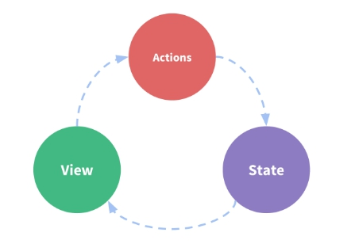

# 十次方前端系统开发-第4章  

# 完成管理后台开发

学习目标：


# 1.路由vue-router

## 1.1什么是vue-router

​	用 Vue.js + vue-router 创建单页应用，是非常简单的。使用 Vue.js ，我们已经可以通过组合组件来组成应用程序，当你要把 vue-router 添加进来，我们需要做的是，将组件(components)映射到路由(routes)，然后告诉 vue-router 在哪里渲染它们。


## 1.2快速入门

### 1.2.1初始化工程

```sh
# 全局安装 vue-cli
$ npm install --global vue-cli
# 创建一个基于 webpack 模板的新项目
$ vue init webpack my-project
# 安装依赖，走你
$ cd my-project
$ npm run dev
```

### 1.2.2路由定义

src/App.vue是我们的主界面，其中的`<router-view/>`标签用于显示各组件视图内容

src/router/index.js是定义路由的脚本  path是路径， name是名称 ，component是跳转的组件  。

（1）我们现在定义两个页面组件，存放在src/components下

list.vue 

```html
<template>
  <div>
    这是一个列表
  </div>
</template>
```

about.vue

```html
<template>
  <div>
    关于我们
  </div>
</template>
```

（2）定义路由

修改src/router/index.js

```js
import Vue from 'vue'
import Router from 'vue-router'
import HelloWorld from '@/components/HelloWorld'
import list from '@/components/list'
import about from '@/components/about'

Vue.use(Router)

export default new Router({
  routes: [
    {
      path: '/',
      name: 'HelloWorld',
      component: HelloWorld
    },
    {
      path: '/list',
      name: 'List',
      component: list
    },
    {
      path: '/about',
      name: 'About',
      component: about
    }
  ]
})
```

（3）放置跳转链接

修改src/app.vue ,添加链接 

```html
    <router-link to="/" >首页</router-link>
    <router-link to="/list">列表</router-link>
    <router-link to="/about">关于</router-link>
```

通过router-link标签实现路由的跳转

router-link标签属性如下：

| 属性      | 类型                 | 含义                                       |
| ------- | ------------------ | ---------------------------------------- |
| to      | string \| Location | 表示目标路由的链接。当被点击后，内部会立刻把 `to` 的值传到 `router.push()`，所以这个值可以是一个字符串或者是描述目标位置的对象。 |
| replace | boolean            | 设置 `replace` 属性的话，当点击时，会调用 `router.replace()` 而不是 `router.push()`，于是导航后不会留下 history 记录。 |
| append  | boolean            | 设置 `append` 属性后，则在当前（相对）路径前添加基路径。例如，我们从 `/a` 导航到一个相对路径 `b`，如果没有配置 `append`，则路径为 `/b`，如果配了，则为 `/a/b` |

测试运行看是否可以跳转页面

## 1.3深入了解

### 1.3.1动态路由

我们经常会遇到这样的需求，有一个新闻列表，点击某一条进入新闻详细页，我们通常是传递新闻的ID给详细页，详细页根据ID进行处理。这时我们就会用到动态路由

一个『路径参数』使用冒号 `:` 标记。当匹配到一个路由时，参数值会被设置到 `this.$route.params`

看代码实现：

在src/components下创建item.vue

```html
<template>
  <div>
    详细页 {{ $route.params.id }}
  </div>
</template>
```

修改src/router/index.js，引入item组件

```js
import item from '@/components/item'
```

添加路由设置

```js
    {
      path: '/item/:id',
      name: 'Item',
      component: item
    }
```

修改src/components/list.vue,  增加链接

```html
<template>
  <div>
    这是一个列表
    <router-link to="/item/1">新闻1</router-link>
    <router-link to="/item/2">新闻2</router-link>
    <router-link to="/item/3">新闻3</router-link>
  </div>
</template>
```


### 1.3.2嵌套路由

实际生活中的应用界面，通常由多层嵌套的组件组合而成。同样地，URL 中各段动态路径也按某种结构对应嵌套的各层组件，例如：

```
/user/foo/profile                     /user/foo/posts
+------------------+                  +-----------------+
| User             |                  | User            |
| +--------------+ |                  | +-------------+ |
| | Profile      | |  +------------>  | | Posts       | |
| |              | |                  | |             | |
| +--------------+ |                  | +-------------+ |
+------------------+                  +-----------------+
```

我们来看代码的实现

（1）在src/components下创建address.vue

```html
<template>
  <div>
    地址：金燕龙
  </div>
</template>
```

创建linkman.vue

```html
<template>
  <div>
    联系人：小二黑
  </div>
</template>
```

（2）修改src/router/index.js

```js
{
      path: '/about',
      name: 'About',
      component: about,
      children: [
        {path: 'linkman', component: linkman},
        {path: 'address', component: address}
      ]
    }
```

（3）修改src/components/about.vue

```html
<template>
  <div>
    关于我们
    <router-link to="/about/address" >地址</router-link>
    <router-link to="/about/linkman" >联系人</router-link>
    <router-view/>
  </div>
</template>
```


## 1.4十次方中路由的实现

### 1.4.1定义路由

我们现在通过看提供的代码来了解

（1）src/router/index.js

```js
import Vue from 'vue'
import Router from 'vue-router'

Vue.use(Router)

/* Layout */
import Layout from '../views/layout/Layout'

export const constantRouterMap = [
  { path: '/login', component: () => import('@/views/login/index'), hidden: true },
  { path: '/404', component: () => import('@/views/404'), hidden: true },
  {
    path: '/',
    component: Layout,
    redirect: '/dashboard',
    name: 'Dashboard',
    hidden: true,
    children: [{
      path: 'dashboard',
      component: () => import('@/views/dashboard/index')
    }]
  },
  {
    path: '/example',
    component: Layout,
    redirect: '/example/table',
    name: 'Example',
    meta: { title: 'Example', icon: 'example' },
    children: [
      {
        path: 'table',
        name: 'Table',
        component: () => import('@/views/table/index'),
        meta: { title: 'Table', icon: 'table' }
      },
      {
        path: 'tree',
        name: 'Tree',
        component: () => import('@/views/tree/index'),
        meta: { title: 'Tree', icon: 'tree' }
      }
    ]
  },
  {
    path: '/form',
    component: Layout,
    children: [
      {
        path: 'index',
        name: 'Form',
        component: () => import('@/views/form/index'),
        meta: { title: 'Form', icon: 'form' }
      }
    ]
  },
  { path: '*', redirect: '/404', hidden: true }
]

export default new Router({
  // mode: 'history', //后端支持可开
  scrollBehavior: () => ({ y: 0 }),
  routes: constantRouterMap
})
```

（2）src/main.js

```js
.....
import router from './router'
.....
new Vue({
  el: '#app',
  router,
  template: '<App/>',
  components: { App }
})
```

### 1.4.2使用路由

在src/views/layout/Sidebar/SidebarItem.vue中用两层嵌套循环实现了菜单的展现

通过el-menu-item和el-submenu展现菜单


## 1.5后台菜单的实现

### 1.5.1代码生成

利用代码生成器生成代码

### 1.5.2路由设置

修改src/router/index.js 中constantRouterMap

```js
export const constantRouterMap = [
  { path: '/login', component: () => import('@/views/login/index'), hidden: true },
  { path: '/404', component: () => import('@/views/404'), hidden: true },
  {
    path: '/',
    component: Layout,
    redirect: '/dashboard',
    name: 'Dashboard',
    hidden: true,
    children: [{
      path: 'dashboard',
      component: () => import('@/views/dashboard/index')
    }]
  },
  {
    path: '/gathering',
    component: Layout,
    redirect: '/example/table',
    name: 'gathering',
    meta: { title: '活动管理', icon: 'example' },
    children: [
      { path: 'gathering', name: 'gathering', component: () => import('@/views/table/gathering'), meta: { title: '活动管理', icon: 'table' }}
    ]
  },
  {
    path: '/recruit',
    component: Layout,
    redirect: '/example/table',
    name: 'recruit',
    meta: { title: '招聘管理', icon: 'example' },
    children: [
      { path: 'enterprise', name: 'enterprise', component: () => import('@/views/table/enterprise'), meta: { title: '企业管理', icon: 'table' }},
      { path: 'recruit', name: 'recruit', component: () => import('@/views/table/recruit'), meta: { title: '招聘管理', icon: 'table' }}
    ]
  },
  {
    path: '/article',
    component: Layout,
    redirect: '/example/table',
    name: 'article',
    meta: { title: '文章管理', icon: 'example' },
    children: [
      { path: 'channel', name: 'channel', component: () => import('@/views/table/channel'), meta: { title: '频道管理', icon: 'table' }},
      { path: 'column', name: 'column', component: () => import('@/views/table/column'), meta: { title: '专栏管理', icon: 'table' }},
      { path: 'article', name: 'article', component: () => import('@/views/table/article'), meta: { title: '文章管理', icon: 'table' }}
    ]
  },
  { path: '*', redirect: '/404', hidden: true }
]
```

我们将上次课做好的活动管理功能拷贝到当前生成的工程中，测试是否正常。

# 2.招聘管理

## 2.1添加菜单

```json
  {
    path: '/recruit',
    component: Layout,
    redirect: '/example/table',
    name: 'recruit',
    meta: { title: '招聘管理', icon: 'example' },
    children: [
      { path: 'enterprise', name: 'enterprise', component: () => import('@/views/table/enterprise'), meta: { title: '企业管理', icon: 'table' }},
      { path: 'recruit', name: 'recruit', component: () => import('@/views/table/recruit'), meta: { title: '招聘管理', icon: 'table' }}
    ]
  },
```


## 2.2企业管理

### 2.2.1企业简介（文本域）

修改src/views/table/enterprise.vue

```html
<el-form-item label="企业简介">
<el-input v-model="pojo.summary" type="textarea" :rows="4"></el-input>
</el-form-item>
```

### 2.2.1是否热门（开关）

修改src/views/table/enterprise.vue编辑窗口中是否热门部分

```html
<el-form-item label="是否热门">
   <el-switch  placeholder="是否热门" on-text="" off-text=""  active-value="1" inactive-value="0" v-model="pojo.ishot" ></el-switch>
</el-form-item>
```


## 2.3招聘管理

### 2.3.1任职方式(单选按钮)

修改src/views/table/recruit.vue

```html
        <el-form-item label="任职方式">
            <el-radio v-model="pojo.type" label="1">全职</el-radio>
            <el-radio v-model="pojo.type" label="2">兼职</el-radio>
        </el-form-item>
```

### 2.3.2选择企业(可搜索下拉选择框)

（1）修改src/views/table/recruit.vue  增加变量--企业列表

```js
enterpriseList: []
```

（2）修改created()

```js
 created() {
      this.fetchData()
      enterprise.getList().then(response => { // 企业列表
        if (response.flag === true) {
          this.enterpriseList = response.data
        }
      })
    },
```

（3）修改弹出窗口部分，将文本框替换为下拉框

```html
        <el-form-item label="企业ID">
          <el-select v-model="pojo.eid" filterable placeholder="请选择">
            <el-option
              v-for="item in enterpriseList"
              :key="item.id"
              :label="item.name"
              :value="item.id">
            </el-option>
          </el-select>        
        </el-form-item>
```

### 2.3.3删除创建日期

创建日期是在后端自动生成的，所以要在弹出窗口中删除控件

### 2.3.4状态（开关）

修改src/views/table/recruit.vue

```html
        <el-form-item label="状态">
           <el-switch  placeholder="是否热门" on-text="" off-text=""  active-value="1" inactive-value="0" v-model="pojo.state" ></el-switch>
        </el-form-item>
```

### 2.3.5网址输入（复合型输入框）

```html
          <el-input v-model="pojo.url" placeholder="请输入网址">
           <template slot="prepend">http://</template>
          </el-input></el-form-item>
```

# 3.文章管理

## 3.1频道管理

修改频道状态为开关，代码略

## 3.2专栏审核

### 3.2.1待审核专栏列表

修改src/table/column.vue  ,修改data变量的值

```
searchMap: {state:'0'},
```

这样在查询时就会携带状态为0的条件。

### 3.2.2专栏审核

（1）修改src/api/column.js ,新增专栏审核方法

```js
  examine(id) {
    return request({
      url: `/${api_name}/examine/${id}`,
      method: 'put'
    })
  }
```

（2）增加方法定义

```js
 handleExamine(id) {
        this.$confirm('确定要审核吗？', '提示', {
          confirmButtonText: '确定',
          cancelButtonText: '取消',
          type: 'warning'
        }).then(() => {
          message.handleShowMessage(column.examine(id), this)
        })
      }
```

（3）审核按钮

```html
<el-button type="warning" plain size="small" @click="handleExamine(scope.row.id)" >审核</el-button>
```

## 3.3文章管理

### 3.3.1待审核文章列表

修改src/table/article.vue  ,修改data变量的值

```
searchMap: {state:'0'},
```

对查询表单进行精简

```html
        <!--查询表单-->
        <el-form :inline="true" class="demo-form-inline">
          <el-form-item label="标题">
<el-input v-model="searchMap.title" placeholder="标题"></el-input></el-form-item>
          <el-form-item label="文章正文">
<el-input v-model="searchMap.content" placeholder="文章正文"></el-input></el-form-item>          
          <el-button type="primary" @click="fetchData()">查询</el-button>
          <el-button type="primary" icon="el-icon-circle-plus" @click="handleEdit('')">新增</el-button>
        </el-form>
```

对表格列进行精简

```html
<el-table-column prop="id" label="ID" width="80"></el-table-column>
          <el-table-column prop="columnid" label="专栏ID" width="80"></el-table-column>
          <el-table-column prop="userid" label="用户ID" width="80"></el-table-column>
          <el-table-column prop="title" label="标题" width="80"></el-table-column>         
          <el-table-column prop="image" label="文章封面" width="80"></el-table-column>
          <el-table-column prop="createtime" label="发表日期" width="80"></el-table-column>
          <el-table-column prop="ispublic" label="是否公开" width="80"></el-table-column>
          <el-table-column prop="istop" label="是否置顶" width="80"></el-table-column>         
          <el-table-column prop="state" label="审核状态" width="80"></el-table-column>
          <el-table-column prop="channelid" label="所属频道" width="80"></el-table-column>
          <el-table-column prop="url" label="URL" width="80"></el-table-column>
          <el-table-column prop="type" label="类型" width="80"></el-table-column>
```

删除“新增”按钮

### 3.3.2文章详情窗口

点击“详情”按钮打开窗口，显示标题和正文  v-html用于显示富文本内容。

```html
        <!--编辑窗口-->
        <el-dialog title="详情" :visible.sync="dialogFormVisible" >
        {{pojo.title}}
        <hr>
        <div v-html='pojo.content'></div>       
        </el-dialog>
```

### 3.3.3文章审核与删除

（1）修改src/api/article.js，增加文章审核的方法

```js
  examine(id) {
    return request({
      url: `/${api_name}/examine/${id}`,
      method: 'put'
    })
  }
```

（2）修改src/views/table/article.vue，增加方法

```js
      handleExamine(id) {
        this.$confirm('确定要审核通过吗？', '提示', {
          confirmButtonText: '确定',
          cancelButtonText: '取消',
          type: 'warning'
        }).then(() => {
          message.handleShowMessage(article.examine(id), this)
          this.dialogFormVisible = false // 隐藏窗口
        })
      }
```

（3）新增审核和删除按钮

```html
        <el-button type="success" @click="handleExamine(pojo.id)" >审核通过</el-button>
        <el-button type="danger" @click="handleDelete(pojo.id)" >删除</el-button>
        <el-button @click="dialogFormVisible = false">关闭</el-button>  
```

（4）删除方法添加代码

```js
this.dialogFormVisible = false // 隐藏窗口
```

# 4.Vuex与登陆状态保存

我们经过测试会发现，用户登陆后可以访问其它页面的资源。未登录或退出登录后，再次访问资源会跳回到登陆页，这是如何实现的呢？长话短说，这是通过一种叫Vuex的技术来实现的。

## 4.1 Vuex简介

​	Vuex 是一个专为 Vue.js 应用程序开发的**状态管理模式**。它采用集中式存储管理应用的所有组件的状态，并以相应的规则保证状态以一种可预测的方式发生变化。

什么是状态管理模式？让我们从一个简单的 代码理解单向数据流：

```js
new Vue({
  // state
  data () {
    return {
      count: 0
    }
  },
  // view
  template: `
    <div>{{ count }}</div>
  `,
  // actions
  methods: {
    increment () {
      this.count++
    }
  }
})
```

这个状态自管理应用包含以下几个部分：

- **state**，驱动应用的数据源；
- **view**，以声明方式将 **state** 映射到视图；
- **actions**，响应在 **view** 上的用户输入导致的状态变化。

以下是一个表示“单向数据流”理念的极简示意：



但是，当我们的应用遇到**多个组件共享状态**时，单向数据流的简洁性很容易被破坏：

- 多个视图依赖于同一状态。
- 来自不同视图的行为需要变更同一状态。

Vuex 的思想就是把组件的共享状态抽取出来，以一个全局单例模式管理。在这种模式下，我们的组件树构成了一个巨大的“视图”，不管在树的哪个位置，任何组件都能获取状态或者触发行为！


## 4.2 Store

每一个 Vuex 应用的核心就是 store（仓库）。“store”基本上就是一个容器，它包含着你的应用中大部分的**状态 (state)**。Vuex 和单纯的全局对象有以下两点不同：

1. Vuex 的状态存储是响应式的。当 Vue 组件从 store 中读取状态的时候，若 store 中的状态发生变化，那么相应的组件也会相应地得到高效更新。
2. 你不能直接改变 store 中的状态。改变 store 中的状态的唯一途径就是显式地**提交 (commit) mutation**。这样使得我们可以方便地跟踪每一个状态的变化，从而让我们能够实现一些工具帮助我们更好地了解我们的应用。

我们这里看一下最简单的例子代码：

```js
// 如果在模块化构建系统中，请确保在开头调用了 Vue.use(Vuex)

const store = new Vuex.Store({
  state: {
    count: 0
  },
  mutations: {
    increment (state) {
      state.count++
    }
  }
})
```

现在，你可以通过 `store.state` 来获取状态对象，以及通过 `store.commit` 方法触发状态变更：

```js
store.commit('increment')
console.log(store.state.count) // -> 1
```


## 4.3 核心概念

### 4.3.1 State

State是状态树，用于保存应用程序中所有的状态

如何在其它组件中获得状态呢？看下面代码：

```js
// 创建一个 Counter 组件
const Counter = {
  template: `<div>{{ count }}</div>`,
  computed: {
    count () {
      return store.state.count
    }
  }
}
```

每当 `store.state.count` 变化的时候, 都会重新求取计算属性，并且触发更新相关联的 DOM。

然而，这种模式导致组件依赖全局状态单例。在模块化的构建系统中，在每个需要使用 state 的组件中需要频繁地导入，并且在测试组件时需要模拟状态。

Vuex 通过 `store` 选项，提供了一种机制将状态从根组件“注入”到每一个子组件中（需调用 `Vue.use(Vuex)`）：

```js
const app = new Vue({
  el: '#app',
  // 把 store 对象提供给 “store” 选项，这可以把 store 的实例注入所有的子组件
  store,
  components: { Counter },
  template: `
    <div class="app">
      <counter></counter>
    </div>
  `
})
```

通过在根实例中注册 `store` 选项，该 store 实例会注入到根组件下的所有子组件中，且子组件能通过 `this.$store`访问到。让我们更新下 `Counter` 的实现：

```js
const Counter = {
  template: `<div>{{ count }}</div>`,
  computed: {
    count () {
      return this.$store.state.count
    }
  }
}
```

### 4.3.2 Getter

有时候我们需要从 store 中的 state 中派生出一些状态，例如对列表进行过滤并计数：

```js
computed: {
  doneTodosCount () {
    return this.$store.state.todos.filter(todo => todo.done).length
  }
}
```

如果有多个组件需要用到此属性，我们要么复制这个函数，或者抽取到一个共享函数然后在多处导入它——无论哪种方式都不是很理想。

Vuex 允许我们在 store 中定义“getter”（可以认为是 store 的计算属性）。就像计算属性一样，getter 的返回值会根据它的依赖被缓存起来，且只有当它的依赖值发生了改变才会被重新计算。

Getter 接受 state 作为其第一个参数：

```js
const store = new Vuex.Store({
  state: {
    todos: [
      { id: 1, text: '...', done: true },
      { id: 2, text: '...', done: false }
    ]
  },
  getters: {
    doneTodos: state => {
      return state.todos.filter(todo => todo.done)
    }
  }
})
```

Getter 会暴露为 `store.getters` 对象：

```js
store.getters.doneTodos // -> [{ id: 1, text: '...', done: true }]
```

Getter 也可以接受其他 getter 作为第二个参数：

```js
getters: {
  // ...
  doneTodosCount: (state, getters) => {
    return getters.doneTodos.length
  }
}
store.getters.doneTodosCount // -> 1
```

我们可以很容易地在任何组件中使用它：

```js
computed: {
  doneTodosCount () {
    return this.$store.getters.doneTodosCount
  }
}
```

### 4.3.3 Mutation

更改 Vuex 的 store 中的状态的唯一方法是提交 mutation。Vuex 中的 mutation 非常类似于事件：每个 mutation 都有一个字符串的 **事件类型 (type)** 和 一个 **回调函数 (handler)**。这个回调函数就是我们实际进行状态更改的地方，并且它会接受 state 作为第一个参数：

```js
const store = new Vuex.Store({
  state: {
    count: 1
  },
  mutations: {
    increment (state) {
      // 变更状态
      state.count++
    }
  }
})
```

你不能直接调用一个 mutation handler。这个选项更像是事件注册：“当触发一个类型为 `increment` 的 mutation 时，调用此函数。”要唤醒一个 mutation handler，你需要以相应的 type 调用 **store.commit** 方法：

```js
store.commit('increment')
```

提交载荷（Payload）

你可以向 `store.commit` 传入额外的参数，即 mutation 的 **载荷（payload）**：

```js
// ...
mutations: {
  increment (state, n) {
    state.count += n
  }
}
store.commit('increment', 10)
```

在大多数情况下，载荷应该是一个对象，这样可以包含多个字段并且记录的 mutation 会更易读：

```js
// ...
mutations: {
  increment (state, payload) {
    state.count += payload.amount
  }
}
store.commit('increment', {
  amount: 10
})
```

一条重要的原则就是要记住 **mutation 必须是同步函数**。

### 4.3.4 Action

Action 类似于 mutation，不同在于：

- Action 提交的是 mutation，而不是直接变更状态。
- Action 可以包含任意异步操作。

让我们来注册一个简单的 action：

```js
const store = new Vuex.Store({
  state: {
    count: 0
  },
  mutations: {
    increment (state) {
      state.count++
    }
  },
  actions: {
    increment (context) {
      context.commit('increment')
    }
  }
})
```

Action 函数接受一个与 store 实例具有相同方法和属性的 context 对象，因此你可以调用 `context.commit` 提交一个 mutation，或者通过 `context.state` 和 `context.getters` 来获取 state 和 getters。

实践中，我们会经常用到 ES6的 [参数解构](https://github.com/lukehoban/es6features#destructuring) 来简化代码（特别是我们需要调用 `commit` 很多次的时候）：

```JS
actions: {
  increment ({ commit }) {
    commit('increment')
  }
}
```

Action 通过 `store.dispatch` 方法触发：

```js
store.dispatch('increment')
```

Actions 支持同样的载荷方式触发:

```js
// 以载荷形式分发
store.dispatch('incrementAsync', {
  amount: 10
})
```

### 4.3.5 Module

由于使用单一状态树，应用的所有状态会集中到一个比较大的对象。当应用变得非常复杂时，store 对象就有可能变得相当臃肿。

为了解决以上问题，Vuex 允许我们将 store 分割成**模块（module）**。每个模块拥有自己的 state、mutation、action、getter、甚至是嵌套子模块——从上至下进行同样方式的分割：

```js
const moduleA = {
  state: { ... },
  mutations: { ... },
  actions: { ... },
  getters: { ... }
}

const moduleB = {
  state: { ... },
  mutations: { ... },
  actions: { ... }
}

const store = new Vuex.Store({
  modules: {
    a: moduleA,
    b: moduleB
  }
})

store.state.a // -> moduleA 的状态
store.state.b // -> moduleB 的状态
```

## 4.4项目结构 

Vuex 并不限制你的代码结构。但是，它规定了一些需要遵守的规则：

1. 应用层级的状态应该集中到单个 store 对象中。
2. 提交 **mutation** 是更改状态的唯一方法，并且这个过程是同步的。
3. 异步逻辑都应该封装到 **action** 里面。

```
├── index.html
├── main.js
├── api
│   └── ... # 抽取出API请求
├── components
│   ├── App.vue
│   └── ...
└── store
    ├── index.js          # 我们组装模块并导出 store 的地方
    ├── actions.js        # 根级别的 action
    ├── mutations.js      # 根级别的 mutation
    └── modules
        ├── cart.js       # 购物车模块
        └── products.js   # 产品模块
```


## 4.5后台登陆的实现

登陆部分的代码已有代码生成器自动生成，只需学员阅读，不需要编写，理解实现思路即可。

### 4.5.1登陆

（1）src/api下创建login.js

```js
import request from '@/utils/request'

export function login(username, password) {
  return request({
    url: '/user/login',
    method: 'post',
    data: {
      username,
      password
    }
  })
}
```

（2）src下建立store文件夹，store下创建modules，modules下创建user.js

```js
import { login, logout, getInfo } from '@/api/login'
import { getToken, setToken, removeToken } from '@/utils/auth'

const user = {
  state: {
    token: getToken(),
    name: '',
    avatar: '',
    roles: []
  },

  mutations: {
    SET_TOKEN: (state, token) => {
      state.token = token
    },
    SET_NAME: (state, name) => {
      state.name = name
    },
    SET_AVATAR: (state, avatar) => {
      state.avatar = avatar
    },
    SET_ROLES: (state, roles) => {
      state.roles = roles
    }
  },

  actions: {
    // 登录
    Login({ commit }, userInfo) {
      const username = userInfo.username.trim()
      return new Promise((resolve, reject) => {
        login(username, userInfo.password).then(response => {
          const data = response.data
          setToken(data.token)
          commit('SET_TOKEN', data.token)
          resolve()
        }).catch(error => {
          reject(error)
        })
      })
    }    
  }
}
export default user
```

（3）store下创建getters.js 

```js
const getters = {
  token: state => state.user.token,
  avatar: state => state.user.avatar,
  name: state => state.user.name,
  roles: state => state.user.roles
}
export default getters
```

（4）store下创建index.js 

```js
import Vue from 'vue'
import Vuex from 'vuex'
import user from './modules/user'
import getters from './getters'

Vue.use(Vuex)

const store = new Vuex.Store({
  modules: {
    user
  },
  getters
})

export default store
```

 （5）修改src下的main.js，引入store

```js
import store from './store'
......
new Vue({
  el: '#app',
  router,
  store,
  template: '<App/>',
  components: { App }
})
```

（6）构建登陆页面.在src/views/login/index.vue

```html
<template>
  <div class="login-container">
    <el-form autoComplete="on" :model="loginForm" :rules="loginRules" ref="loginForm" label-position="left" label-width="0px"
      class="card-box login-form">
      <h3 class="title">十次方管理后台</h3>
      <el-form-item prop="username">
        <span class="svg-container svg-container_login">
          <svg-icon icon-class="user" />
        </span>
        <el-input name="username" type="text" v-model="loginForm.username" autoComplete="on" placeholder="username" />
      </el-form-item>
      <el-form-item prop="password">
        <span class="svg-container">
          <svg-icon icon-class="password"></svg-icon>
        </span>
        <el-input name="password" :type="pwdType" @keyup.enter.native="handleLogin" v-model="loginForm.password" autoComplete="on"
          placeholder="password"></el-input>
          <span class="show-pwd" @click="showPwd"><svg-icon icon-class="eye" /></span>
      </el-form-item>
      <el-form-item>
        <el-button type="primary" style="width:100%;" :loading="loading" @click.native.prevent="handleLogin">
          Sign in
        </el-button>
      </el-form-item>
      <div class="tips">
        <span style="margin-right:20px;">username: admin</span>
        <span> password: admin</span>
      </div>
    </el-form>
  </div>
</template>
<script>
import { isvalidUsername } from '@/utils/validate'
export default {
  name: 'login',
  data() {
    const validateUsername = (rule, value, callback) => {
      if (!isvalidUsername(value)) {
        callback(new Error('请输入正确的用户名'))
      } else {
        callback()
      }
    }
    const validatePass = (rule, value, callback) => {
      if (value.length < 5) {
        callback(new Error('密码不能小于5位'))
      } else {
        callback()
      }
    }
    return {
      loginForm: {
        username: 'admin',
        password: 'admin'
      },
      loginRules: {
        username: [{ required: true, trigger: 'blur', validator: validateUsername }],
        password: [{ required: true, trigger: 'blur', validator: validatePass }]
      },
      loading: false,
      pwdType: 'password'
    }
  },
  methods: {
    showPwd() {
      if (this.pwdType === 'password') {
        this.pwdType = ''
      } else {
        this.pwdType = 'password'
      }
    },
    handleLogin() {
      this.$refs.loginForm.validate(valid => {
        if (valid) {
          this.loading = true
          this.$store.dispatch('Login', this.loginForm).then(() => {
            this.loading = false
            this.$router.push({ path: '/' })
          }).catch(() => {
            this.loading = false
          })
        } else {
          console.log('error submit!!')
          return false
        }
      })
    }
  }
}
</script>
....样式略
```


### 4.5.2获取用户登陆信息

（1）修改src/api/login.js

```js
export function getInfo(token) {
  return request({
    url: '/user/info',
    method: 'get',
    params: { token }
  })
}
```

（2）修改src/store/modules/user.js,增加action方法

```js
    // 获取用户信息
    GetInfo({ commit, state }) {
      return new Promise((resolve, reject) => {
        getInfo(state.token).then(response => {
          const data = response.data
          commit('SET_ROLES', data.roles)
          commit('SET_NAME', data.name)
          commit('SET_AVATAR', data.avatar)
          resolve(response)
        }).catch(error => {
          reject(error)
        })
      })
    },
```

（3）在src下创建permission.js  ，实现用户信息的拉取

```js
import router from './router'
import store from './store'
import NProgress from 'nprogress' // Progress 进度条
import 'nprogress/nprogress.css'// Progress 进度条样式
import { Message } from 'element-ui'
import { getToken } from '@/utils/auth' // 验权

const whiteList = ['/login'] // 不重定向白名单
router.beforeEach((to, from, next) => {
  NProgress.start()
  if (getToken()) {
    if (to.path === '/login') {
      next({ path: '/' })
    } else {
      if (store.getters.roles.length === 0) {
        store.dispatch('GetInfo').then(res => { // 拉取用户信息
          next()
        }).catch(() => {
          store.dispatch('FedLogOut').then(() => {
            Message.error('验证失败,请重新登录')
            next({ path: '/login' })
          })
        })
      } else {
        next()
      }
    }
  } else {
    if (whiteList.indexOf(to.path) !== -1) {
      next()
    } else {
      next('/login')
      NProgress.done()
    }
  }
})

router.afterEach(() => {
  NProgress.done() // 结束Progress
})
```

（4）在顶部导航栏中实现头像的读取。

修改src\views\layout\components\Navbar.vue   

```js
<script>
import { mapGetters } from 'vuex'
import Breadcrumb from '@/components/Breadcrumb'
import Hamburger from '@/components/Hamburger'

export default {
  components: {
    Breadcrumb,
    Hamburger
  },
  computed: {
    ...mapGetters([
      'sidebar',
      'avatar'
    ])
  },
  methods: {
    toggleSideBar() {
      this.$store.dispatch('ToggleSideBar')
    },
    logout() {
      this.$store.dispatch('LogOut').then(() => {
        location.reload() // 为了重新实例化vue-router对象 避免bug
      })
    }
  }
}
</script>
```

读取头像

```html
      <div class="avatar-wrapper">
        
        <i class="el-icon-caret-bottom"></i>
      </div>
```

### 4.5.3退出登录

（1）修改src/api/login.js

```js
export function logout() {
  return request({
    url: '/user/logout',
    method: 'post'
  })
}
```

（2）修改src/store/modules/user.js,增加action方法

```js
    // 登出
    LogOut({ commit, state }) {
      return new Promise((resolve, reject) => {
        logout(state.token).then(() => {
          commit('SET_TOKEN', '')
          commit('SET_ROLES', [])
          removeToken()
          resolve()
        }).catch(error => {
          reject(error)
        })
      })
    },
```

（3）在顶部导航栏中实现退出登录

```js
    logout() {
      this.$store.dispatch('LogOut').then(() => {
        location.reload() // 为了重新实例化vue-router对象 避免bug
      })
    }
```

```html
 <el-dropdown-item divided>
      <span @click="logout" style="display:block;">退出登录</span>
 </el-dropdown-item>
```


